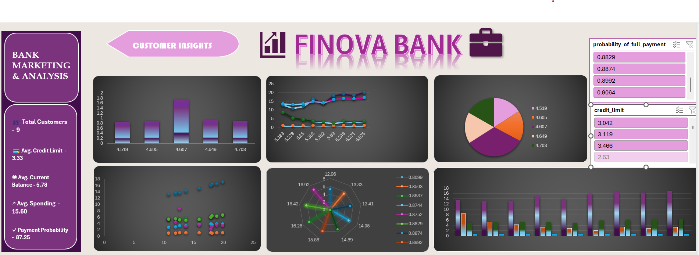

# 🏦 FINOVA BANK – Customer Insights Dashboard

An interactive Excel dashboard built to analyze customer financial and payment-related data. The dashboard transforms raw banking data into clear visual insights using KPIs, PivotTables, PivotCharts, and interactive slicers.

---

## 📊 Overview

The **FINOVA BANK Customer Insights Dashboard** provides a visual analysis of customer spending, credit limits, current balances, advance payments, and payment behaviour.

The project focuses on presenting financial data in a simple and interactive dashboard format using Microsoft Excel.

---

## 🎯 Project Objectives

- Analyze customer financial behaviour
- Understand spending and payment patterns
- Compare customer credit limits and current balances
- Track payment-related metrics
- Convert raw data into meaningful visualizations
- Build an interactive and visually appealing Excel dashboard

---

## 🔑 Key Features

- 📌 KPI cards for important customer metrics
- 📊 Interactive PivotCharts
- 🎛️ Interactive slicers for filtering data
- 💳 Credit limit and current balance analysis
- 💰 Customer spending analysis
- 💵 Advance payment analysis
- 📈 Payment probability analysis
- 🎨 Custom banking-themed dashboard design
- 📋 PivotTables for data summarization

---

## 📈 Dashboard KPIs

The dashboard includes key metrics such as:

- **Total Customers**
- **Average Credit Limit**
- **Average Current Balance**
- **Average Spending**
- **Maximum Single Purchase**
- **Payment Probability**

---

## 📊 Visualizations

The dashboard uses multiple types of charts to present the data:

- 📊 Bar / Column Charts
- 🥧 Pie Charts
- 📈 Line Charts
- 🔵 Scatter Charts
- 🕸️ Radar Charts

These visualizations help identify patterns and relationships within the customer data.

---

## 🎛️ Interactive Features

The dashboard includes interactive **Excel Slicers** that allow users to filter and explore the data dynamically.

Users can interact with the dashboard to view different customer financial patterns and compare different metrics.

---

## 🛠️ Tools Used

- **Microsoft Excel**
- PivotTables
- PivotCharts
- Slicers
- Excel Formulas
- Data Cleaning & Preparation
- Data Visualization
- Dashboard Design

---

## 📁 Dataset

The project uses a **Bank Marketing / Customer Financial dataset** containing customer-level financial information such as:

- Spending
- Advance Payments
- Probability of Full Payment
- Current Balance
- Credit Limit
- Minimum Payment Amount
- Maximum Spent in a Single Shopping

The dashboard was created using a sample of customer records for learning and portfolio development.

---

## 🔗 Interactive Excel Dashboard

You can view the interactive Excel dashboard here:

👉 **[View the FINOVA BANK Excel Dashboard](https://1drv.ms/x/c/9d3cc06d7f5f1e49/IQDwnB5e-TayRaHDTS0oQBAoAZl8yzvkSVz22csJf5f45PY?e=dKga5W)**

---

## 📸 Dashboard Preview

The dashboard provides an interactive view of customer financial and payment-related data through KPIs, charts, PivotTables, and Slicers.

---

## 📌 Key Analysis Areas

The dashboard focuses on:

- Customer spending behaviour
- Credit limit analysis
- Current balance analysis
- Payment behaviour
- Advance payment patterns
- Minimum payment analysis
- Relationship between financial variables

---

## 🚀 What I Learned

Through this project, I learned how to:

- Work with raw datasets in Excel
- Perform basic data preparation
- Create and customize PivotTables
- Build PivotCharts
- Use slicers for interactive analysis
- Calculate KPIs using Excel formulas
- Choose appropriate charts for different types of data
- Design a professional-looking analytics dashboard
- Present data in a simple and understandable way

---

## 🔮 Future Improvements

I plan to further improve this project by:

- Adding more customer data
- Performing deeper statistical analysis
- Recreating the dashboard in Power BI
- Using SQL for data analysis
- Exploring Python for advanced analytics
- Adding more advanced customer segmentation

---

## 📂 Project Files

- 📊 **Bank Marketing Dashboard.xlsx** – Interactive Excel dashboard
- 🖼️ **Dashboard_Preview.png** – Dashboard screenshot
- 📄 **README.md** – Project documentation

---

## 👩‍💻 Author

**Shambhavi Allyadwar**

Aspiring Data Analyst | BCA Graduate | Data Science & Analytics Learner

---

⭐ If you found this project interesting, feel free to explore the dashboard and connect with me!
